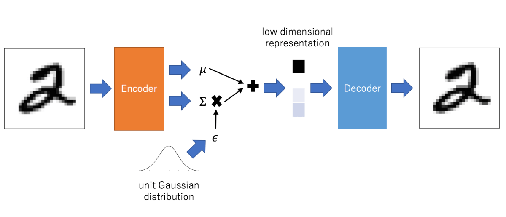

<h1 align="center">Autoencoder</h1> 
An autoencoder is a type of artificial neural network used to learn efficient codings of unlabeled data (unsupervised learning). The encoding is validated and refined by attempting to regenerate the input from the encoding. The autoencoder learns a representation (encoding) for a set of data, typically for dimensionality reduction, by training the network to ignore insignificant data (“noise”).

## Architecture
The core of Autoencoder is the code-decode operation. Both the encoder and decoder may be Convolutional Neural Network or fully-connected feedforward neural networks.
An autoencoder has three main parts: 
- An encoder that maps the input into the code.
- A decoder that maps the code to a reconstruction of the input.
- Latent Space, which is the layers in the middle contains the decoded information.

## Types
<h3>Denoising autoencoder:</h3> Creates a corrupted copy of the input by introducing some noise. This helps to avoid the autoencoders to copy the input to the output without learning features about the data. These autoencoders take a partially corrupted input while training to recover the original undistorted input. The model learns a vector field for mapping the input data towards a lower dimensional manifold which describes the natural data to cancel out the added noise.
</img> <b>Advantages:</b> It was introduced to achieve good representation. Such a representation is one that can be obtained robustly from a corrupted input and that will be useful for recovering the corresponding clean input.
Corruption of the input can be done randomly by making some of the input as zero. Remaining nodes copy the input to the noised input.
Minimizes the loss function between the output node and the corrupted input.

<h3>Sparse Autoencoder:</h3> Have hidden nodes greater than input nodes. They can still discover important features from the data. A generic sparse autoencoder is visualized where the obscurity of a node corresponds with the level of activation. Sparsity constraint is introduced on the hidden layer. This is to prevent output layer copy input data. Sparsity may be obtained by additional terms in the loss function during the training process, either by comparing the probability distribution of the hidden unit activations with some low desired value,or by manually zeroing all but the strongest hidden unit activations. Some of the most powerful AIs in the 2010s involved sparse autoencoders stacked inside of deep neural networks. 
</img> 
<b>Advantages:</b> Have a sparsity penalty, a value close to zero but not exactly zero. Sparsity penalty is applied on the hidden layer in addition to the reconstruction error. This prevents overfitting. They take the highest activation values in the hidden layer and zero out the rest of the hidden nodes. This prevents autoencoders to use all of the hidden nodes at a time and forcing only a reduced number of hidden nodes to be used.  <b>Drawbacks:</b> For it to be working, it's essential that the individual nodes of a trained model which activate are data dependent, and that different inputs will result in activations of different nodes through the network.

<h3>Deep Autoencoder:</h3>Deep Autoencoders consist of two identical deep belief networks, oOne network for encoding and another for decoding. Typically deep autoencoders have 4 to 5 layers for encoding and the next 4 to 5 layers for decoding. We use unsupervised layer by layer pre-training for this model. The layers are Restricted Boltzmann Machines which are the building blocks of deep-belief networks. Processing the benchmark dataset MNIST, a deep autoencoder would use binary transformations after each RBM. Deep autoencoders are useful in topic modeling, or statistically modeling abstract topics that are distributed across a collection of documents. They are also capable of compressing images into 30 number vectors.</img> 
 <b>Advantages:</b>Deep autoencoders can be used for other types of datasets with real-valued data, on which you would use Gaussian rectified transformations for the RBMs instead. Final encoding layer is compact and fast.
 <b>Drawbacks</b>Chances of overfitting to occur since there's more parameters than input data.
Training the data maybe a nuance since at the stage of the decoder’s backpropagation, the learning rate should be lowered or made slower depending on whether binary or continuous data is being handled.

<h3>Contractive Autoencoder:</h3>The objective of a contractive autoencoder is to have a robust learned representation which is less sensitive to small variation in the data. Robustness of the representation for the data is done by applying a penalty term to the loss function. Contractive autoencoder is another regularization technique just like sparse and denoising autoencoders. However, this regularizer corresponds to the Frobenius norm of the Jacobian matrix of the encoder activations with respect to the input. Frobenius norm of the Jacobian matrix for the hidden layer is calculated with respect to input and it is basically the sum of square of all elements.
</img>  <b>Advantages:</b>Contractive autoencoder is a better choice than denoising autoencoder to learn useful feature extraction.
This model learns an encoding in which similar inputs have similar encodings. Hence, we're forcing the model to learn how to contract a neighborhood of inputs into a smaller neighborhood of outputs.

<h3>Undercomplete Autoencoder:</h3>The objective of undercomplete autoencoder is to capture the most important features present in the data. Undercomplete autoencoders have a smaller dimension for hidden layer compared to the input layer. This helps to obtain important features from the data. It minimizes the loss function by penalizing the g(f(x)) for being different from the input x.
</img>  <b>Advantages:</b>Undercomplete autoencoders do not need any regularization as they maximize the probability of data rather than copying the input to the output. <b>Drawbacks:</b>Using an overparameterized model due to lack of sufficient training data can create overfitting.

<h3>Convolutional Autoencoder:</h3>Autoencoders in their traditional formulation does not take into account the fact that a signal can be seen as a sum of other signals. Convolutional Autoencoders use the convolution operator to exploit this observation. They learn to encode the input in a set of simple signals and then try to reconstruct the input from them, modify the geometry or the reflectance of the image. They are the state-of-art tools for unsupervised learning of convolutional filters. Once these filters have been learned, they can be applied to any input in order to extract features. These features, then, can be used to do any task that requires a compact representation of the input, like classification.
</img> <b>Advantages:</b>Due to their convolutional nature, they scale well to realistic-sized high dimensional images.
Can remove noise from picture or reconstruct missing parts.
 <b>Drawbacks:</b>The reconstruction of the input image is often blurry and of lower quality due to compression during which information is lost.

<h3>Variational Autoencoder:</h3>Variational autoencoder models make strong assumptions concerning the distribution of latent variables. They use a variational approach for latent representation learning, which results in an additional loss component and a specific estimator for the training algorithm called the Stochastic Gradient Variational Bayes estimator. It assumes that the data is generated by a directed graphical model and that the encoder is learning an approximation to the posterior distribution where Ф and θ denote the parameters of the encoder (recognition model) and decoder (generative model) respectively. The probability distribution of the latent vector of a variational autoencoder typically matches that of the training data much closer than a standard autoencoder.
</img>  <b>Advantages:</b>It gives significant control over how we want to model our latent distribution unlike the other models.
After training you can just sample from the distribution followed by decoding and generating new data. <b>Drawbacks:</b>
When training the model, there is a need to calculate the relationship of each parameter in the network with respect to the final output loss using a technique known as backpropagation. Hence, the sampling process requires some extra attention.

<h3>I'm going to implement the Convolutional Autoencoder</h3>

### Sources
<a href="https://iq.opengenus.org/types-of-autoencoder/">Types of Autoencoder</a> 
<a href="https://en.wikipedia.org/wiki/Autoencoder">Autoencoder</a>
